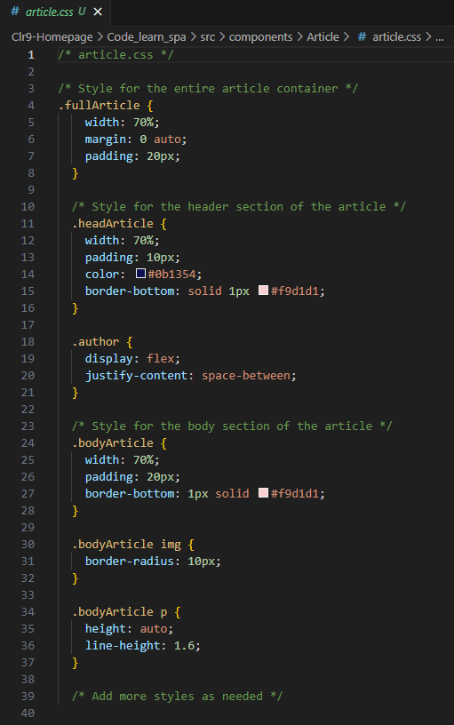
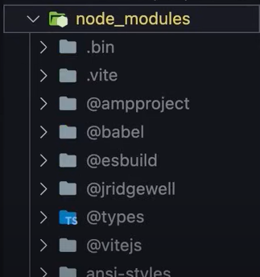
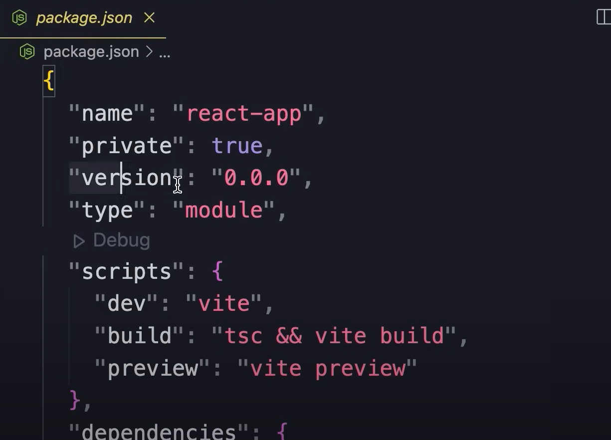
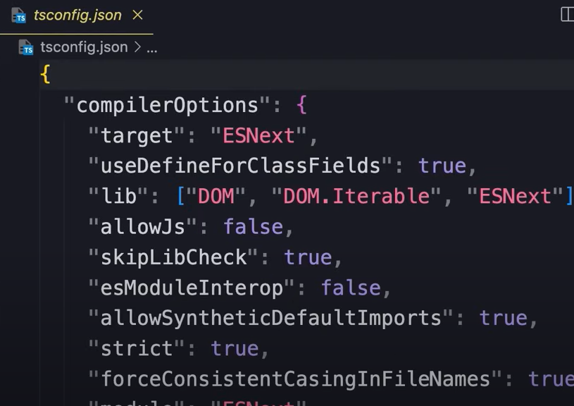
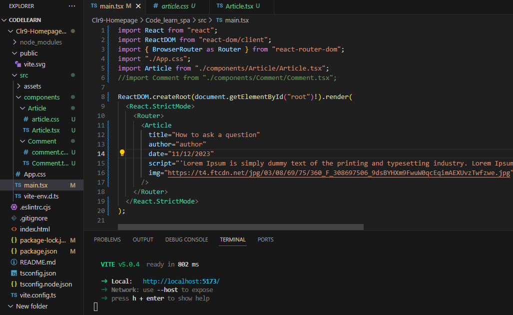
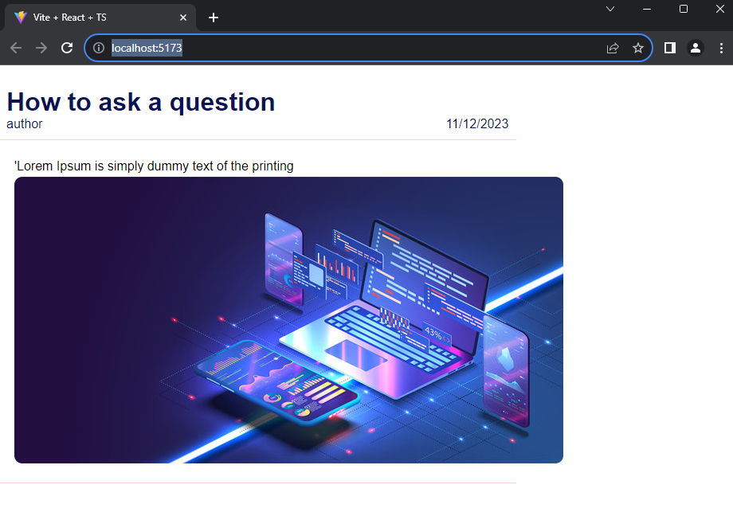

# CodeLearn Web Platform

Welcome to CodeLearn, your ultimate resource for comprehensive programming knowledge and a thriving community for collaborative learning.

## Overview

CodeLearn is a web-based project that houses a rich repository of articles spanning various programming topics. Our platform is designed to equip learners with in-depth knowledge while fostering a sense of community through an interactive forum.

## Features

- **Diverse Knowledge Base:** Explore a vast collection of articles covering a wide range of programming subjects. From beginner-friendly tutorials to advanced concepts, CodeLearn is your one-stop destination for continuous learning.

- **Interactive Forum:** Engage with a dynamic community of developers on our forum. Pose questions, share insights, and collaborate with fellow learners to overcome programming challenges. Our community is here to support your growth.

- **User-Friendly Interface:** Experience a visually appealing and intuitive user interface that ensures seamless navigation. The design is crafted to be both eye-catching and approachable, creating an environment that resonates with programmers of all levels.

# Table of Contents
* [Installation](#installation)
* [Project Structure](#project-structure)
* [Demo](#demo)
* [Contact Information](#contact-information)

## Installation
Follow these steps to set up CodeLearn on your local machine:

### Setting Up the Development environment

Before you begin, ensure you have the following installed:

- Visual Studio Code
- Node.js (version 16 or higher)
- npm (comes with Node.js installation)
- Prettier Extension

### Creating a React App

We can use Vite because it's much faster and gives us small bundle sizes:

- To create an app using Vtie we use `npm create vite@latest`
- Next we need to specify project name `codelearn-app`
- Next we select a framework `React`
- Select language `TypeScript`
- Next we go to codelearn-app by using `cd codelearn-app` and install all the third party dependencies by using `npm i`
- Finally, run web with `npm run dev`

### Creating a React Components

In React, each component typically consists of two files: a .tsx file for the component's JavaScript/TypeScript logic and a .css file for its styling. This separation allows for clean code organization, where the .tsx file handles the component's functionality, and the .css file manages its visual styling.

Start by creating a new file for your component in the `src/components` directory. For example, to create a `Article` component:

- Main Components of Article.tsx:
  1. Imports:
**React:** Provides the functions and components necessary to build a user interface.
**./article.css:** Defines the styling for the Article component.
  2. Interface:
**ArticleProps:** Defines the properties that must be passed to the Article component.
  3. Component Definition:
**Article:** A React functional component that renders the article content.
  Takes ArticleProps as input.
  Defines a variable maxLength to limit the displayed text length.
  4. Rendered Elements:
  A container element with class fullArticle.
  Inside the container:
**headArticle:** Contains the title and author/date information.
**bodyArticle:** Shows the preview text and image
  5. Export:
  Makes the Article component available for other modules to use.

  

- Main Components of Article.css:
  This CSS file is a text file that contains style rules for HTML elements. It is used to control the appearance of a web page, such as the size, color, and position of elements.
  This CSS file is typically organized into two sections:
  **Selectors:** These are rules that specify which HTML elements the style rules apply to.
  **Declarations:** These are rules that define the properties of the HTML elements.
  
  

## Project Structure

The project is organized in the following structure:

- Node modules folder is where all the third-party libraries are installed

- Source folder is a source code of our application

- We have a component called the App Component

- The package.json file contains the information about the project

- Typescript Configurationfile is a bunch of settings for telling typescript compiler how to compile our code to JavaScript

- Configuration file for Vite

## Demo

- The codebase demonstrates best practices in React and TypeScript, showcasing the elegant implementation of the Article component.

- Experience the CodeLearn web application live! To run the application locally, use the command npm run dev to execute the main.tsx file for testing the code. After running the command, access the website to see the CodeLearn web application in action.

## Contact Information

Feel free to reach out to us if you have any questions or need assistance. We're here to help!

### Lê Thanh Tuấn
- **Email:** [21520518@gm.uit.edu.vn](mailto:21520518@gm.uit.edu.vn)

### Phạm Thái Bảo
- **Email:** [21520156@gm.uit.edu.vn](mailto:21520156@gm.uit.edu.vn)

### Lê Thị Huyền Trang
- **Email:** [21522694@gm.uit.edu.vn](mailto:21522694@gm.uit.edu.vn)
  
### Huỳnh Hoa
- **Email:** [21522080@gm.uit.edu.vn](mailto:21522080@gm.uit.edu.vn)
